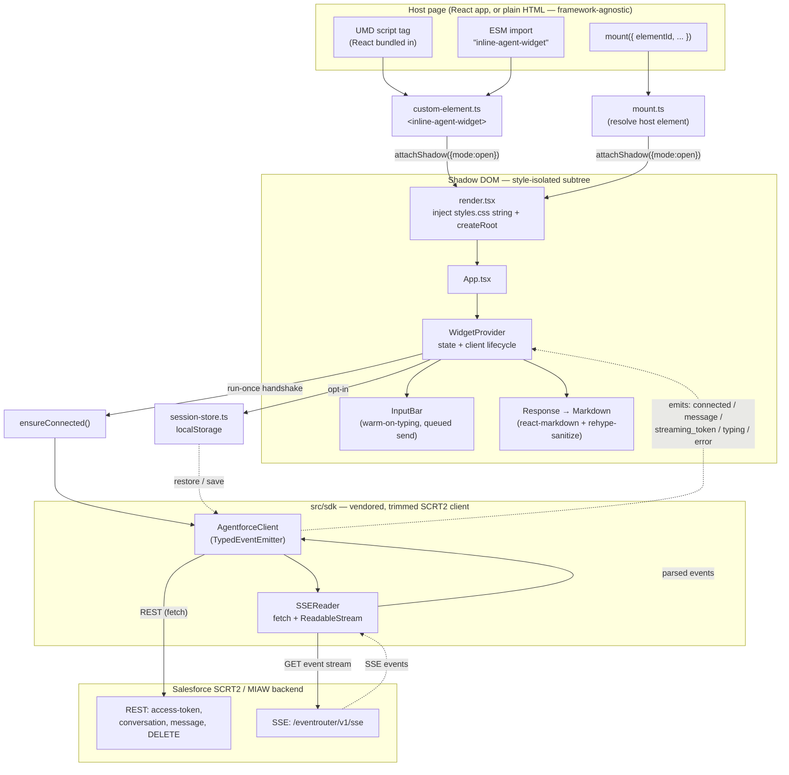
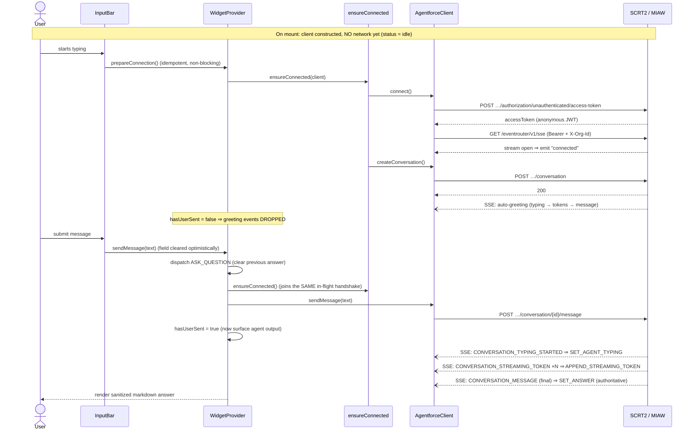
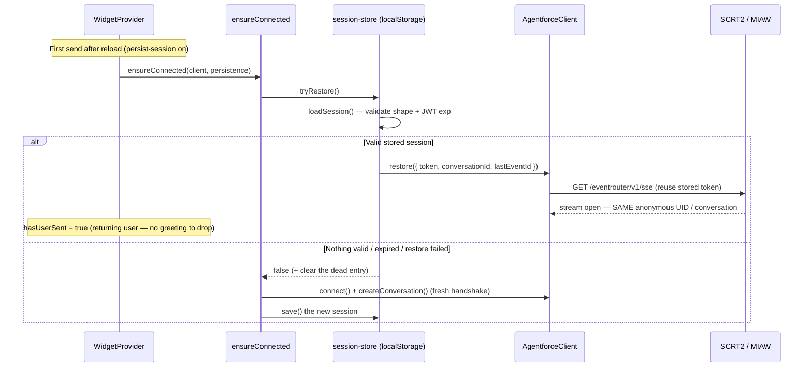
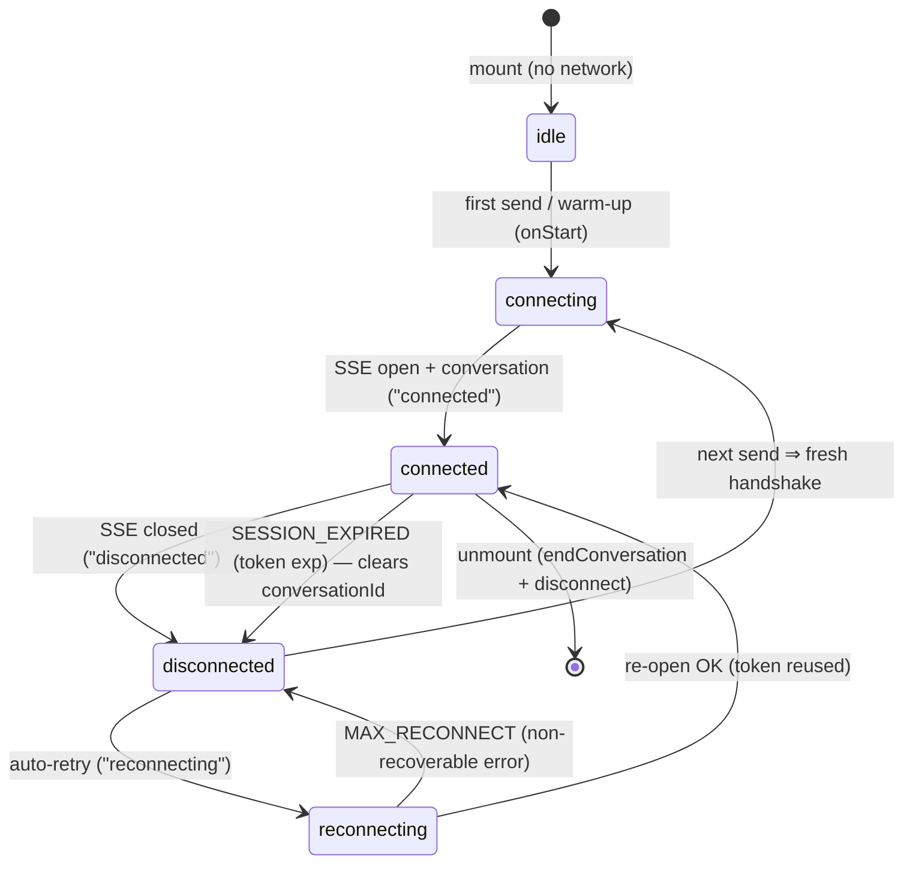

# Architecture

This document explains how **inline-agent-widget** is structured and how a
message flows end to end. For the *why* behind choosing SCRT2/MIAW as the
connectivity path, see [`connectivity-options.md`](./connectivity-options.md).

---

## 1. What it is

A bare-minimum, embeddable **inline** chat widget for **Salesforce Agentforce**
over the anonymous **SCRT2 (Messaging for In-App and Web / MIAW)** path. It
renders an always-visible block — a text input on top, the agent's answer to the
most recent question below — inside a **Shadow DOM** so host-page styles and the
widget's styles can't leak into each other. Replies stream token-by-token and
render as **sanitized markdown**.

Design tenets that shape the architecture:

- **No secret in the browser.** Only the public SCRT2 identifiers (`scrt2Url`,
  `orgId`, `esDeveloperName`) are used — the same values Salesforce's own
  embedded-messaging snippet exposes.
- **Nothing hits the network on mount.** The token → SSE → conversation
  handshake is deferred until the first send (optionally warmed on typing).
- **Single-answer model.** Asking a new question replaces the previous answer;
  there is no accumulating transcript.
- **Framework-agnostic delivery.** Ships as a self-contained UMD custom element
  and as an ESM module (React as a peer).

---

## 2. High-level architecture



**Layering, top to bottom:**

| Layer | Files | Responsibility |
|---|---|---|
| **Delivery / entry** | `index.ts`, `custom-element.ts`, `mount.ts` | Register `<inline-agent-widget>` (side effect on import); or mount imperatively. Attach an open shadow root. |
| **Rendering** | `render.tsx`, `App.tsx`, `styles.css` | Inject the stylesheet as a string into the shadow root (never `document.head`), mount a React 18 root, validate required config. |
| **UI** | `components/InputBar.tsx`, `components/Response.tsx`, `components/Markdown.tsx` | Input with warm-on-typing + optimistic clear; single-answer response region (typing / streaming / answer / error); sanitized markdown. |
| **State + orchestration** | `provider/WidgetProvider.tsx`, `context.ts`, `reducer.ts`, `types.ts`, `ensure-connected.ts`, `session-store.ts` | Own the client lifecycle, wire SDK events to a reducer, gate the agent's auto-greeting, run the lazy handshake once, and (optionally) persist the session. |
| **Transport (vendored SDK)** | `sdk/client.ts`, `sse.ts`, `event-emitter.ts`, `errors.ts`, `logger.ts`, `types.ts` | Anonymous token mint, conversation lifecycle, message send, fetch-based SSE with auto-reconnect + backoff, token-refresh on 401. |

---

## 3. Directory structure

```text
src/
  index.ts              Entry — auto-registers the custom element; re-exports mount() + SDK surface
  custom-element.ts     <inline-agent-widget> class: observed attributes → WidgetConfig, shadow root
  mount.ts              Imperative mount() into element/elementId (waits via MutationObserver)
  render.tsx            Inject styles.css (as string) + createRoot; renders config-error if required attrs missing
  App.tsx               <WidgetProvider><InputBar/><Response/></WidgetProvider>
  styles.css            Widget styles (imported ?inline, injected into the shadow root)
  tokens.ts             Extract renderable text from SCRT2 / BYON-Freeform payloads (unwrap {response:[…]})
  env.d.ts              Vite client + *.css?inline module typings

  components/
    InputBar.tsx        Text input; prepareConnection() on typing; fire-and-forget queued send
    Response.tsx        Single-answer region: error > typing dots > streaming preview > final answer
    Markdown.tsx        react-markdown + remark-gfm + rehype-sanitize (no rehype-raw)

  provider/
    WidgetProvider.tsx  Client construction, event wiring, greeting suppression, persistence glue
    context.ts          React context + useWidget() hook
    reducer.ts          WidgetState reducer (status / answer / streamingText / agentTyping / error)
    types.ts            WidgetConfig, WidgetState, WidgetAction, WidgetContextValue
    ensure-connected.ts Run-once lazy handshake helper (restore-first, else fresh); React-free + unit-tested
    session-store.ts    Opt-in localStorage persistence; JWT-exp bounded; shape/expiry validation

  sdk/                  Vendored, trimmed SCRT2 (Agentforce MIAW) client — no external SDK dependency
    index.ts            Public SDK surface (AgentforceClient + errors + types)
    client.ts           AgentforceClient: token, conversation, send, SSE mgmt, reconnect, token refresh
    sse.ts              SSEReader: fetch + ReadableStream frame parser (allows custom auth headers)
    event-emitter.ts    Typed event emitter base class
    errors.ts           AgentforceClientError → {Api, Network, Auth} subclasses
    logger.ts           Gated [Agentforce] debug logger
    types.ts            SDK request/response/event types

demo/index.html         Live dev harness (npm run dev) — placeholder SCRT2 config
docs/                   architecture.md (this file) + connectivity-options.md (decision record)
tests/                  Vitest: SDK client, ensure-connected, session-store, tokens (+ helpers/mocks)
vite.config.ts          ESM library build (dist/index.mjs) + .d.ts bundling
vite.umd.config.ts      UMD bundle (dist/inline-agent-widget.umd.js, React bundled)
vitest.config.ts        Test runner config (node env)
```

---

## 4. Runtime flow — first message

Nothing touches the network until the user engages. Warm-on-typing hides the
handshake latency behind the user's typing, and the agent's automatic greeting
(emitted when the conversation is created) is **suppressed** until the user
actually sends something.



Key guarantees:

- **Exactly one handshake.** `ensureConnected` keys readiness on
  `conversationId` and memoizes the in-flight promise, so a send fired before
  warm-up finishes simply awaits the same attempt (effectively a queue). A
  partial handshake (stream up, conversation not yet created) is retried without
  re-minting the token.
- **Greeting suppression.** All agent-originated events are ignored while
  `hasUserSent` is false, so the auto-greeting (which arrives during the warm-up
  window) never appears. The flag flips to true only after the user's send is
  accepted.
- **Authoritative final.** The final `CONVERSATION_MESSAGE` replaces the streamed
  preview, so any token-parsing drift self-heals.

---

## 5. Runtime flow — session persistence (opt-in)

With `persist-session`, the minimal session snapshot (`accessToken`,
`conversationId`, `lastEventId` — **never transcript text**) is stored in
`localStorage`, namespaced by `orgId + esDeveloperName`. On the next page load
the widget rehydrates the *same* anonymous conversation instead of minting a new
token.



Reuse is bounded **solely by the token's own JWT `exp`** (set by the server at
mint). An expired or malformed entry is refused and proactively cleared on load;
the session is also cleared when the conversation ends or the SDK reports a
non-recoverable `SESSION_EXPIRED`. See the README security note for the
shared/kiosk-device trade-off.

---

## 6. Connection state machine

`ConnectionStatus` (in `reducer.ts`) is driven by `ensureConnected`'s "start"
callback plus the SDK's lifecycle events.



- **Reconnect** reuses the existing token (preserving the anonymous identity and
  conversation) with exponential backoff + jitter, up to `maxReconnectAttempts`.
- **Token expiry** during a reconnect emits a non-recoverable `SESSION_EXPIRED`
  and clears `conversationId`; the *next* send transparently starts a fresh
  handshake (a new token = new UID, so the old conversation can't be resumed).
- **401 on a REST call** auto-refreshes the token **only before** a conversation
  exists; once a conversation is live a 401 surfaces as an auth error (refreshing
  would orphan the conversation).

---

## 7. Message payload handling

SCRT2 replies arrive in more than one shape, normalized in `tokens.ts`:

- **Plain-text agents** send text directly.
- **BYON Freeform agents** JSON-encode output: a final message is a
  `{"response":[{"type":"markdown","data":{"content":"…"}}, {"type":"suggestions",…}]}`
  envelope; streaming tokens are typed blocks. Only text blocks (those exposing
  `data.content`) are rendered; `suggestions`/control blocks are skipped.

`extractTokenText` (streaming) and `extractMessageText` (final) share one
extraction core but differ in fallback: an undecodable **token** yields nothing
(never flash raw JSON — the final message overwrites the buffer anyway), whereas
an undecodable **final message** falls back to the raw string (never silently
drop a real reply). All rendered text passes through `rehype-sanitize` — raw HTML
and `javascript:` URLs are stripped; `rehype-raw` is deliberately not used.

---

## 8. Build & distribution

Two builds from one source (`npm run build`):

| Output | Config | React | Consumer |
|---|---|---|---|
| `dist/index.mjs` (+ `dist/index.d.ts`) | `vite.config.ts` | **external** (peer) | ESM / bundler apps that dedupe to one React |
| `dist/inline-agent-widget.umd.js` | `vite.umd.config.ts` | **bundled** | Plain `<script>` / CDN, non-React pages |

CSS is imported with `?inline`, so no `.css` asset is emitted and nothing is
injected into `document.head` — the stylesheet is added to the shadow root at
runtime. `package.json` `exports`/`main`/`module`/`unpkg` map each consumer to
the right artifact.

---

## 9. Security model (summary)

- **Anonymous, unauthenticated token** — blast radius if leaked is *this
  messaging conversation only*; no login/CRM access. No client secret ships to
  the browser.
- **Shadow DOM (`mode: open`)** is a **style** isolation boundary, not a JS
  security boundary.
- **Sanitized markdown** — `rehype-sanitize`, no raw HTML.
- **Persistence** stores the minimum, is bounded by token `exp`, and self-cleans;
  prefer leaving it off on shared/kiosk devices.

See the [README security section](../README.md#security) for the full treatment.
