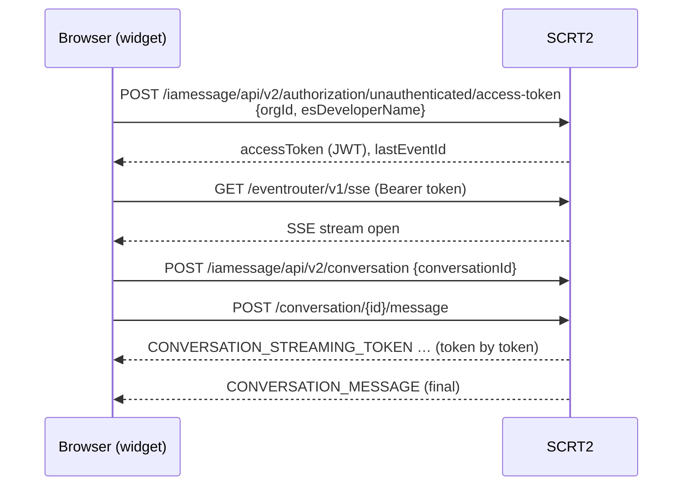
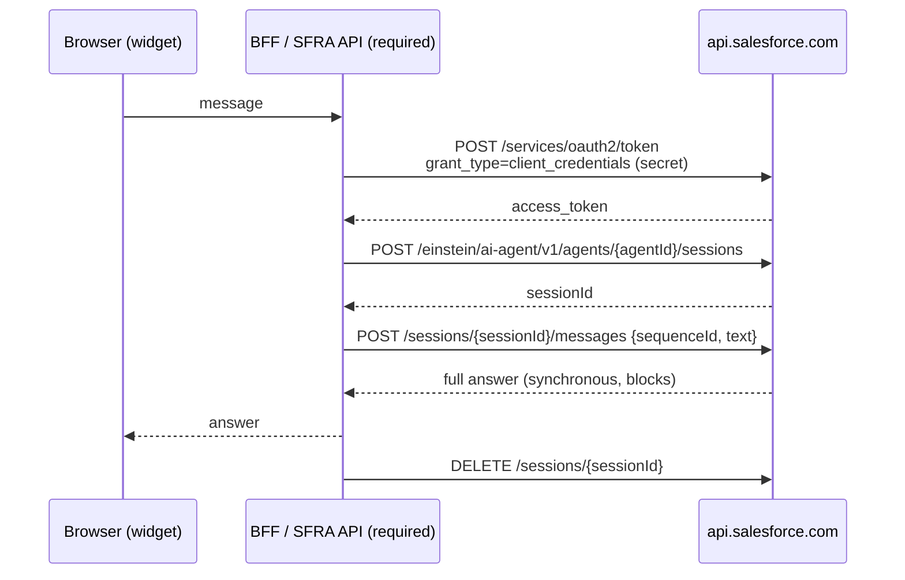

# Inline Agent Widget — Connectivity Options

**SCRT2 / MIAW vs. the Agentforce Agent API for a public, embeddable inline agent client**

| | |
|---|---|
| Status | Draft for review |
| Scope | How a public inline agent widget reaches an Agentforce agent, and which API path we should build on |
| Recommendation | **SCRT2 / MIAW** for the custom React storefront inline client |

---

## 1. The public inline agent widget

### What it is

A self-contained, embeddable block that renders a text input and, beneath it, the agent's answer to the most recent question. It is *inline* rather than a floating chat bubble: it sits in the page flow (e.g. on a PDP, between the product gallery and the add-to-cart panel) and behaves like page content.

The entire UI lives inside a **Shadow DOM**, and it ships in three consumable forms:

| Form | Host requirement | Typical use |
|---|---|---|
| UMD `<script>` + `<inline-agent-widget>` custom element | None — no build step, React is bundled | Marketing pages, SFRA/ISML templates, CMS blocks, non-React storefronts |
| ESM module (`import "inline-agent-widget"`) | Bundler; React 18 as a peer dependency | Custom React storefronts (sf-next), Next.js apps |
| Imperative `mount(element, options)` | Bundler | Programmatic placement, A/B frameworks, dynamic slots |

### Why "place it anywhere" actually holds

These are the properties that make arbitrary placement safe, and they're the core of the argument for this shape:

- **It's a custom element.** The integration surface is one HTML tag with attributes. Any templating system that can emit HTML can host it — ISML, Handlebars, a CMS rich-text block, a JSX tree, a Google Tag Manager injection. No framework coupling.
- **Shadow DOM isolation in both directions.** Host page CSS can't leak in and break the widget; widget CSS can't leak out and break the storefront. This is what removes the per-page QA burden that normally makes embeddable UI expensive to place.
- **Theming without forking.** Appearance is driven by CSS custom properties (`src/tokens.ts`), so a host page restyles the widget to match its brand by setting variables — not by overriding internals.
- **No secret in the browser (SCRT2 mode).** The anonymous SCRT2 token flow means there is nothing confidential to protect, so the widget can be served from a CDN to any public page. This is the single biggest enabler of "anywhere" — see §2.
- **No backend on the data path (SCRT2 mode).** The widget talks to Salesforce directly. There is no service to deploy, scale, or route per placement.
- **Sanitized rendering.** Agent output is rendered as markdown through `rehype-sanitize`; no raw HTML injection into the host page.
- **Lazy handshake.** No network calls happen until the shopper actually sends a message (`ensureConnected`), so placing the widget on a page costs nothing until it is used — important when it appears on every PDP.
- **Same component for inline and chat surfaces.** One artifact, one release train, one set of agent-side behavior to validate.

### Trade-offs to go in with open eyes

- **Host-page CSP.** Pages with a strict `Content-Security-Policy` need the script origin and the Salesforce connect-src allowlisted. This is a per-customer onboarding step, not a code change.
- **Abuse surface.** A public, unauthenticated token endpoint reachable from any page is by definition open to scripted traffic. Rate limiting / bot protection is a platform-side concern that must be sized before launch.
- **Bundle weight on the UMD path.** React is bundled for the no-build-step path; pages that already run React should use the ESM path to dedupe.
- **Single-answer UX by design.** The inline block replaces the previous answer rather than keeping a transcript. That is the right call for a PDP assist, but it is not a drop-in replacement for a full chat surface.
- **Storage availability.** Session continuity relies on `localStorage`; in private mode or sandboxed iframes it degrades to a fresh session per page load (handled gracefully, but latency is paid again).

---

## 2. How to call the agent

Two public paths exist. This repo implements the **SCRT2 / MIAW** path (`src/sdk/client.ts`); the Agentforce Agent API was prototyped alongside it behind the same client interface (`ConnectableClient`) to make the comparison concrete rather than theoretical, and — having settled the decision below in SCRT2's favor — that prototype has since been removed so the codebase carries a single path. The reducer, components, and handshake helper were identical for both; only the client-construction differed.

### 2a. SCRT2 / MIAW (Messaging for In-App and Web)

**Call sequence**



**Auth model.** Guest chat needs *no backend at all* — the browser calls the unauthenticated access-token endpoint with only an Org ID and deployment name. Nothing secret ships to the browser because there is nothing secret to ship. Authenticated chat needs only a **thin JWT signer**: one small server endpoint signs a User-Verification JWT per session, with the private key staying server-side (fed from SLAS). Critically, that backend sits on the **auth path, not the data path** — it does not proxy every message.

**Identity.** Per-shopper identity is available out of the box, rather than a single fixed "Run As" user.

**Session reuse — how we restore tokens.** This is the part that keeps session count and latency down, and it is already built:

1. After a successful handshake, we persist a **minimal** snapshot to `localStorage` — `{ accessToken, conversationId, lastEventId }` and nothing else (never transcript text), under a key namespaced by org and deployment: `iaw:sess:{orgId}:{esDeveloperName}`.
2. On the next page load, before doing anything on the network, `ensureConnected` calls `tryRestore()`. The store validates the blob's shape and reads the JWT's own `exp` claim; anything expired or malformed is deleted on the spot rather than left lying around at a well-known key.
3. If the token is still valid, `client.restore()` adopts the stored token **and** conversation id and simply reopens the SSE stream. **No new token is minted and no new conversation is created.** This is not an optimization detail — minting a fresh token produces a new anonymous UID, which would 403 against the existing conversation.
4. Only if there is nothing restorable do we fall back to the full handshake (token → SSE → conversation).
5. Mid-session stream drops are handled separately: reconnect reuses the *existing* token with exponential backoff and jitter, preserving conversation ownership. Once the token's `exp` passes, we emit a non-recoverable `SESSION_EXPIRED` and the next send starts cleanly.

The net effect is that a shopper browsing across PDPs continues **one** conversation for the life of the token, instead of opening a session per page. Reuse is bounded solely by the token's own expiry — we honor it, we cannot lengthen it. *(We already do this in the commerce client; still to confirm the same behavior on the sf-next side.)*

**Pros**

- No backend at all for guest chat; a thin JWT signer for authenticated chat. Dramatically less auth plumbing for the same React UI.
- No secret in browser JS → safe to embed on any public page.
- Real token-by-token streaming, so perceived latency is low even when the agent is slow.
- Per-shopper identity out of the box.
- Salesforce hosts session, streaming, and scaling. Escalation to a human and transcripts are available if we ever want them.
- Session restore (above) reduces session count and skips the handshake on repeat page loads.
- One less network hop than the Agent API production shape (browser → SCRT2 directly).

**Cons**

- Messaging-shaped API: conversation/session semantics come with messaging baggage we don't strictly need for a single-answer inline block.
- Requires a Messaging for In-App and Web deployment to be configured in the org.
- The anonymous token is a bearer credential in `localStorage`. Blast radius is limited to the messaging conversation (no user credentials, no CRM access), but on shared/kiosk devices the walk-up reuse window is the full token lifetime — persistence should be left off for those deployments.
- Streaming means an open SSE connection per active widget.

### 2b. Agentforce Agent API (Einstein AI Agent API)

**Call sequence — the full cycle, every time**



There is no resumable stream and therefore **nothing to restore**. Where SCRT2 can rehydrate a session from `localStorage` and skip straight to sending, the Agent API path must walk the whole cycle — get token, create session, send message, end session. A `410` or a `SessionEnded` control message clears the session, and the next send opens a new one (the token, at least, is still reusable).

**Auth model.** OAuth 2.0 client-credentials, which requires a **confidential client secret**. Per RFC 6749 that grant is for confidential server-side clients only, and Salesforce's own guidance is that the browser must never see the secret. This is not a policy we can wave through: shipping the secret in browser JS exposes it to every visitor. A BFF layer is therefore **mandatory**, not optional.

Two consequences worth stating plainly:

- `api.salesforce.com/einstein/*` and the org OAuth endpoint **do not send CORS headers** for a browser origin, so a direct in-browser fetch is blocked regardless of the secret question. (Adding the origin to the org's CORS allowlist does not help — `api.salesforce.com` is outside its scope.) A browser-only deployment would need a server-side proxy — the local analog of the future SFRA+Vault backend — to reach it at all.
- Even in production the path is browser → your backend → `api.salesforce.com`, one hop more than SCRT2's direct browser → SCRT2.

**Pros**

- Direct access to the agent primitive without messaging semantics in the way.
- Session variables are a first-class part of session creation, which is a cleaner context story than message-text injection (see §4).
- Server-side by construction, so the secret and any business logic stay under our control.

**Cons**

- **Requires a BFF layer** that mints the bearer token and proxies calls — a service to build, deploy, secure, scale, and keep on the data path for every message.
- Customers must set up an External Credential app in eCommerce and rotate secrets. That is real onboarding friction per customer.
- Synchronous send: the request blocks until the full answer exists (server-side timeout is 120s). No streamed tokens, so perceived latency must be solved in UX rather than by the protocol.
- Single fixed "Run As" user rather than per-shopper identity. **Logged-in user management can force a rewrite.**
- Separate architecture from the chat PDP solution → two implementations to maintain, and customer confusion about which is which.
- No session restore; the full cycle runs each time.

### Side-by-side

| | SCRT2 / MIAW | Agent API |
|---|---|---|
| Backend required | No (guest) / thin JWT signer (authenticated) | Yes — BFF on the data path |
| Secret in browser | None | Would be required without a BFF → not viable |
| CORS from a browser | Works | Blocked |
| Streaming | Token-by-token over SSE | Synchronous, full answer |
| Identity | Per-shopper | Single "Run As" user |
| Session reuse | Restore token + conversation from `localStorage` | None — full cycle each time |
| Network hops | Browser → SCRT2 | Browser → BFF → Salesforce |
| Customer onboarding | MIAW deployment | External Credential app + secret rotation |
| Escalation / transcripts | Available | Not applicable |

---

## 3. Recommendation

**SCRT2 / MIAW wins for a custom React storefront inline client.**

The same React UI, with dramatically less auth plumbing. SCRT2 exposes a browser-safe token flow, so the React app talks to it with no secret and little or no backend — exactly the authentication ease we were optimizing for. Guest chat needs no backend at all; authenticated chat needs a thin JWT signer on the auth path, not the data path. We additionally get per-shopper identity out of the box, Salesforce-hosted session/streaming/scaling, and escalation and transcripts sitting there if we ever want them.

---

## 4. Passing page context to the agent

Independent of the transport choice, the inline widget needs to tell the agent what the shopper is looking at (e.g. the PDP's product). The Context API is not available yet, so this is a near-term decision.

### Approach A — SCRT2 directly, with a prepended context line

Prepend a lightweight context line to the user's message text and instruct the agent to read it:

```
[context: productId=SKU-789] <the user's actual question>
```

**Pros**

- Unblocks us immediately.
- When the Context API ships, backend and UX can be swapped independently.
- No special auth solution needed.
- Same architecture for both the inline and chat-based PDP solutions.
- Once the Context API is released, the change is contained and the Agentscript changes should be minimal.

**Cons**

- Ugly string parsing and maintenance — though mainly on the Salesforce side.
- We will have to live with this code for 3–4 months, given the upcoming eCommerce and Dreamforce moratorium.
- Agentscript still needs changes and some handholding.
- Roughly 2–3s of additional latency.

**Note on sessions.** To avoid opening a session per page, we save the SCRT2 token in `localStorage` and reuse it — see the restore flow in §2a. This is already how the commerce client behaves; still to be confirmed on the sf-next side.

### Approach B — Agent API directly, with a BFF

Maintain a BFF layer that provides the bearer token and becomes the service that calls into the Agent API.

**Pros**

- Context can be passed as first-class session variables rather than parsed out of message text.

**Cons**

- Latency is a concern and would have to be solved through UX.
- A separate auth mechanism to implement.
- Customers must set up an External Credential app in eCommerce and rotate secrets.
- Separate architecture maintenance for inline vs. chat PDP; customers will be confused by the split implementation.
- Logged-in user management can force a rewrite.

### Recommendation

Take **Approach A** now. It is reversible, it needs no new service, and it keeps the inline and chat PDP surfaces on one architecture while we wait for the Context API.

---

## 5. Open items

- Check whether eCommerce already has a BFF-layer solution — Neeraj mentioned a custom client solution on the Agent API for one of the customers that may be worth reusing if we ever need path B.
- Confirm on the sf-next side that the SCRT2 token is saved and reused the way the commerce client does it, so we don't regress into one session per page.
- Size rate limiting / bot protection for the public unauthenticated token endpoint before launch.

## References

- [`README.md`](../README.md) — usage, attributes, security notes
- `src/sdk/client.ts` — SCRT2 client: token, SSE, conversation, `restore()`, reconnect
- `src/provider/session-store.ts` — persisted session shape, validation, expiry handling
- `src/provider/ensure-connected.ts` — restore-first handshake
